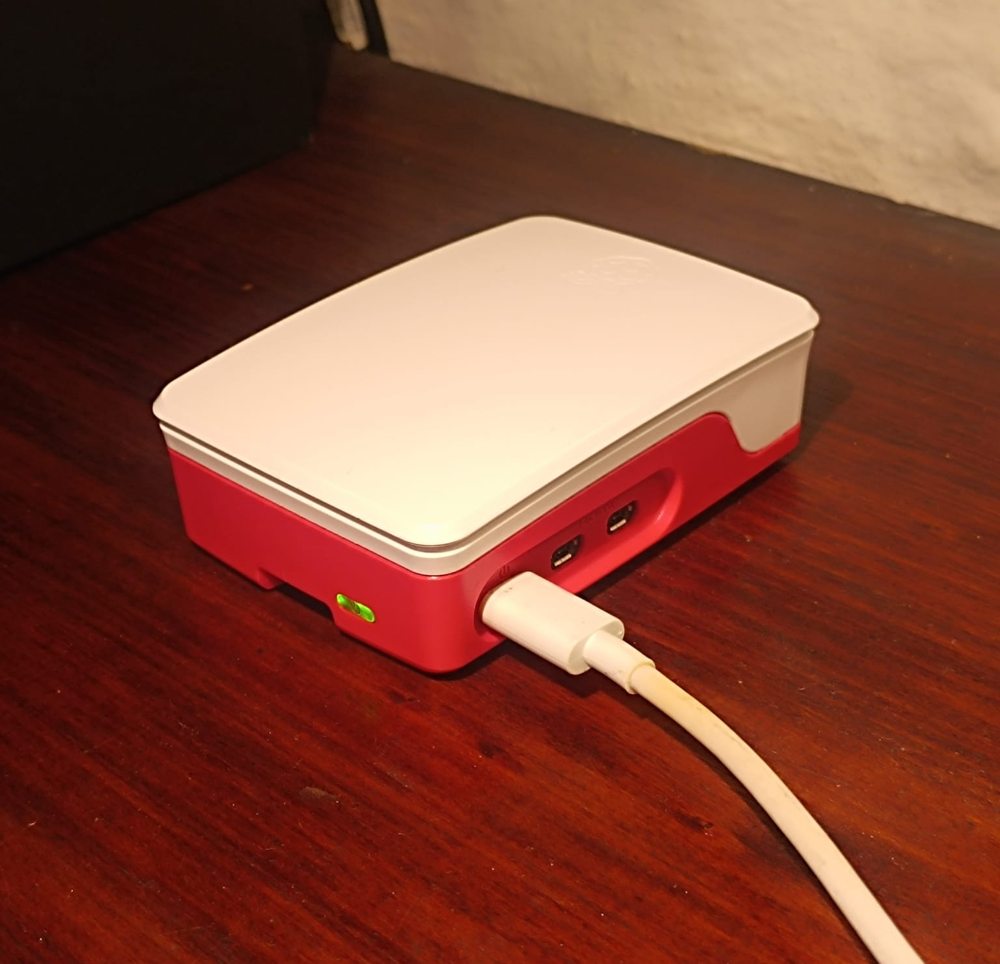
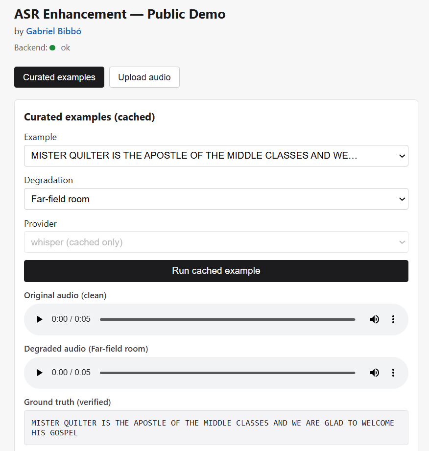
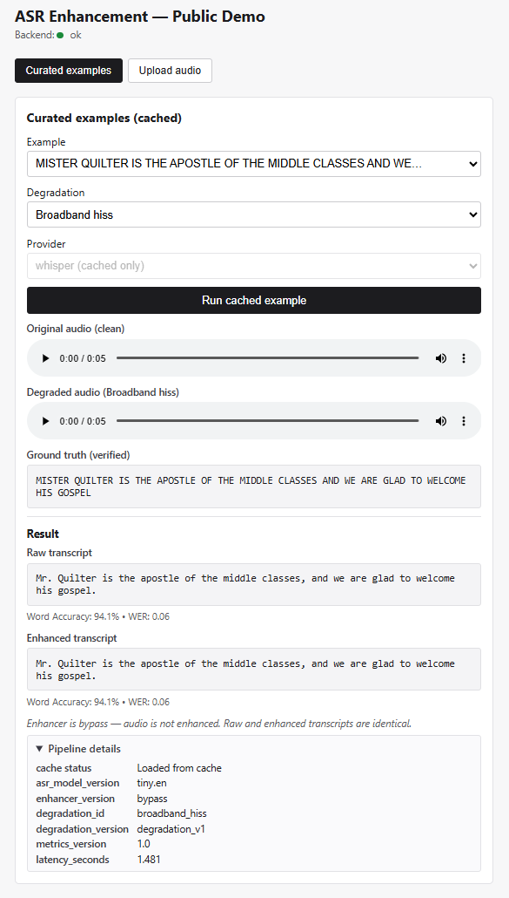

# ASR Enhancement — Speech Enhancement for Robust Transcription

By **Gabriel Bibbó** · [github.com/gbibbo/asr_enhancement](https://github.com/gbibbo/asr_enhancement)

> **🔴 Live demo:** **https://asr-rp5.tail072b8f.ts.net/demo/** — sign in with username `recruiter` and password `asr-demo-2026`.

A full-stack demo that shows how audio degradation hurts automatic speech
recognition (ASR) and how a speech-enhancement stage sits in front of the
recogniser to recover accuracy. It runs as a **public, mobile-first web demo on
a Raspberry Pi 5**, and the same codebase also ships a heavier **cloud platform
mode**.



## What it does

Pick a curated speech clip (or upload your own, up to 30 s), choose a
**degradation** (far-field room, café background, phone call, muffled, broadband
hiss) and an **ASR provider**, and the demo shows, side by side:

- the **clean** and **degraded** audio (playable in the browser),
- the **raw transcript** of the degraded audio,
- the **enhanced transcript** (or an honest baseline — see *Enhancer status*),
- **Word Accuracy / WER** against ground truth when it is available,
- pipeline details: provider, model version, enhancer version, cache status,
  job id, and latency.

Curated examples return instantly from a versioned cache; uploads go through an
asynchronous job queue and are transcribed on-device.

## ▶️ Live demo — try it now

**https://asr-rp5.tail072b8f.ts.net/demo/**

| | |
|---|---|
| **Username** | `recruiter` |
| **Password** | `asr-demo-2026` |

Open the link, enter the username and password above when the browser asks, and
the demo loads. It runs **live on a Raspberry Pi 5** behind an HTTPS tunnel with
a single sign-in that covers the whole UI. Because it runs on personal hardware
and a home connection, treat it as **best-effort, not always-on**.

<!-- Screenshots -->


Mobile layout: 

## Two run modes

| | Public demo mode | Cloud platform mode |
|---|---|---|
| Host | Raspberry Pi 5, Docker | any VPS / cloud, Docker Compose |
| State | SQLite | PostgreSQL |
| Storage | local filesystem | MinIO (S3-compatible) |
| Queue | in-process worker (concurrency 1) | Celery + Redis |
| ASR | faster-whisper `tiny.en` (local) + optional AssemblyAI | fake provider + optional AssemblyAI |
| Observability | JSON logs, `/admin/stats`, email alerts | Prometheus, Grafana, OpenTelemetry |
| Exposure | Tailscale Funnel + recruiter gate | reverse proxy |

Public demo mode does **not** require Postgres, Redis, MinIO, Prometheus,
Grafana, or an OpenTelemetry collector. Platform mode is preserved under the
`platform-mvp-v0` tag and its `/v1/*` API is intact.

## Enhancer status (honest)

The enhancement stage is currently a **bypass baseline** (`ENHANCER_VERSION=1.0`,
label `bypass`): the pipeline, versioning, cache contract, and UI treat the
enhancer as a first-class stage, but **no learned enhancement model is deployed
yet**. The parallel training branch has not produced a deployable artifact, so
the demo does not claim any learned accuracy improvement. The architecture keeps
a clean seam (`libs/audio/enhancement.py`) for a MetricGAN+ or similar model to
drop in later. See [`docs/model_card.md`](docs/model_card.md).

## Architecture (demo mode)

```text
Browser ──HTTPS──> Tailscale Funnel ──> 127.0.0.1:8001 ──> FastAPI (demo-api)
                                         │  recruiter HTTP Basic gate on every route
                                         │  serves the static Next.js UI + the /demo API
                                         └─> SQLite (jobs, cache, usage) + filesystem artifacts
                                              demo-worker (concurrency 1) processes uploads
                                              faster-whisper tiny.en (local ASR)
```

The Next.js frontend is built as a **static export** and served by FastAPI on a
single origin, so one recruiter sign-in covers the UI, its assets, and the API,
and the browser talks to the backend directly (no separate Node server).

## Privacy

- Uploaded audio is processed for the session and cleaned up on a schedule; it is
  not kept long-term.
- Optional **manual ground truth** for uploads is used only to compute Word
  Accuracy **in your browser** — it never leaves the page, is never sent to the
  backend, logged, stored, or used for training.
- Non-English audio triggers a warning before processing (the demo targets
  English speech).

Details: [`docs/privacy.md`](docs/privacy.md).

## Cost controls (AssemblyAI, optional)

AssemblyAI is an **optional** cloud provider and is **disabled by default** (no
API key configured in the public demo). When enabled it is cost-controlled:
per-audio-duration cost estimate, a usage ledger in SQLite, a daily soft cap,
warning cap, and hard cap, per-session limits, and explicit UI states
(available / daily quota reached / quota exhausted / disabled). The demo never
silently falls back from AssemblyAI to Whisper.

## Run the demo locally

Requires Docker and (to rebuild the UI) Node ≥ 18.

```bash
git clone https://github.com/gbibbo/asr_enhancement.git
cd asr_enhancement
cp .env.demo.example .env.demo   # then set RECRUITER_USERNAME / RECRUITER_PASSWORD
```

Build the static UI and stage it where the demo API serves it:

```bash
cd services/frontend && npm ci && npm run build && cd ../..
mkdir -p "$HOME/asr_enhancement_runtime/frontend"
cp -r services/frontend/out/. "$HOME/asr_enhancement_runtime/frontend/"
```

Bring up the stack:

```bash
docker compose -f infra/compose/docker-compose.demo.yml --env-file .env.demo up -d --build
```

Open `http://localhost:8001/` (it redirects to `/demo/`). You will be prompted
for the recruiter credentials you set in `.env.demo`. For public exposure and
the recruiter-gate re-smoke, see
[`docs/setup/rp5_public_exposure.md`](docs/setup/rp5_public_exposure.md).

Cloud platform mode (fake provider, no secrets) is documented separately in
[`docs/deployment.md`](docs/deployment.md).

## Tech stack

FastAPI · faster-whisper (CTranslate2) · SQLite · Next.js 14 (static export) ·
Docker Compose · Tailscale Funnel · Raspberry Pi 5. Platform mode adds Celery,
Redis, PostgreSQL, MinIO, Prometheus, Grafana, and OpenTelemetry.

## Repository layout

```text
asr_enhancement/
  libs/            # shared: ASR adapters, audio pipeline, metrics, degradations, versions, demo, observability
  services/
    api/           # FastAPI (platform /v1 + demo /demo, recruiter gate, static UI serving)
    worker/        # Celery worker (platform) + demo worker
    frontend/      # Next.js UI (static export)
  infra/compose/   # docker-compose.yml (platform) + docker-compose.demo.yml (demo)
  docs/            # plans, progress, setup runbooks, model card, privacy
  tests/           # unit, integration, demo, smoke
```

## Status

Public demo mode is **live** on the Raspberry Pi 5: curated examples, uploads,
transcription, playback, the recruiter gate, and mobile layout all work
end-to-end over the public URL. Remaining work is documentation polish and the
formal multi-network re-smoke record. Platform mode (MVP) is preserved under the
`platform-mvp-v0` tag.
